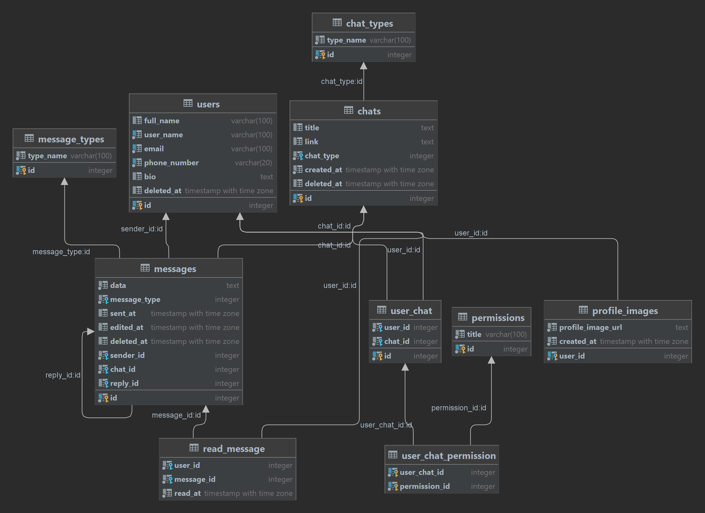

# About

This project is a database for a messenger application.

# Features

- Users with profile images
- Chats include PV, group and channel
- Read message datetime per person

# Usage

1. Run `1-create_database.sql` script for creating database.
2. Run `2-create_tables.sql` script for creating tables.
3. Run `3-populate_database.sql` script for populating types tables.
4. You can see some sample queries in `4-queries.sql file`.

# Diagram

