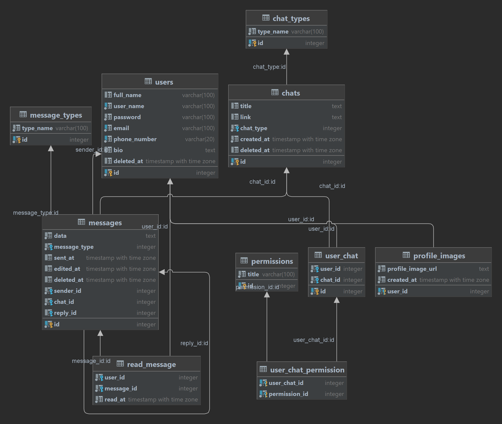

# About

This project is a database for a messenger application with some of its useful methods using JDBC.

# Features

- Users with profile images and bios
- The ability to delete account
- Chats include PV, group and channel
- Different permissions for sending messages
- The ability to edit and delete messages
- Read message datetime per person

# Usage

1. Run `1-create_database.sql` script for creating database.
2. Run `2-create_tables.sql` script for creating tables.
3. Run `3-populate_database.sql` script for populating types tables.
4. You can use methods ready in Main class for changing the data in database.

# Schema

